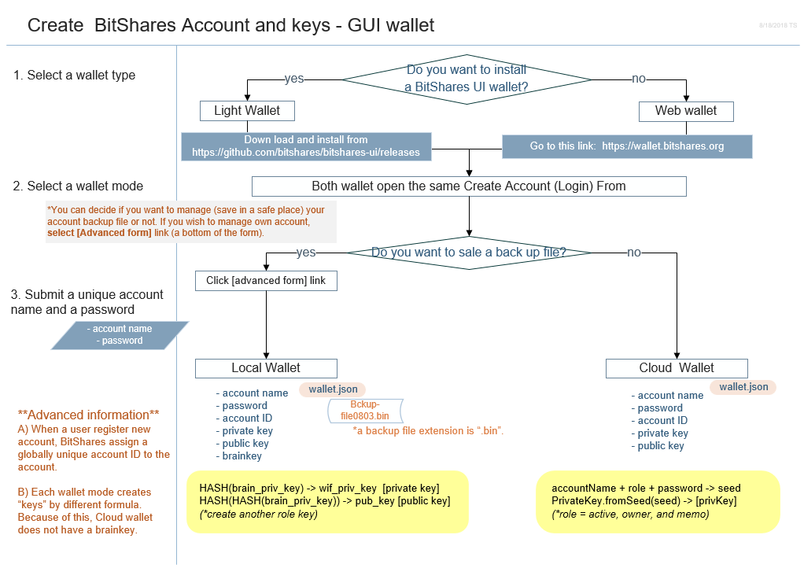
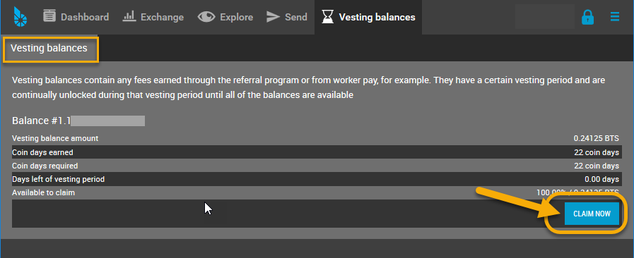

## BitShares Accounts
In BitShares, you can create an account relatively easily by using the BitShares UI wallet.  The account comes with the Private/public keys. You should keep the information safe. Also, BitShares account gives you some benefits (i.e., Lifetime Membership (LTM) and Referral Program) and important roles (i.e., voting).  We recommend you to read through BitShares Accounts information to learn more.

- [Account](../accounts#account)
- [Memberships and Groups](../accounts#memberships-and-groups)
- [Fees](../accounts#fees)
- [Vesting Balances](../accounts#vesting-balances)
- [Permissions](../accounts/accounts/permissions.md#permissions)
- [Referral Program](../accounts/accounts/referral-program.md#referral-program)
- [Voting](../accounts/accounts/voting-bh.md#voting)
  - Voting for… Witnesses, Committee, or/and Workers
  
### FAQ - Accounts

- [Account Registration](../accounts/account_registration.md#account-registration)
  : Create a CLI account
- [How to change a password if using a Cloud Wallet](https://github.com/bitshares/bitshares-ui/wiki/Cloud-Wallet-Login-and-changing-password) : from BitShares UI wiki
- [more...](../tutorials/FAQ.md#accounts)
- Knowledge Base: [Multi-Signature](../knowledge_base/multi-signature.md#multi-signature)  

****

## Account

In BitShares, you can create an account relatively easily by using the BitShares UI wallet. When you create a BitShares Account from the UI wallet, it will ask you to provide a unique Account name and a password. Although you should create a strong password, you can create readable and memorable BitShares account name. You do not need to write down a long random number as your account name. The BitShares account name would be helpful to identify other BitShares accounts.

It's important to understand that **only** you know your password, and no one can recover it.  The account information is registered to the blockchain with private/public keys of the account. Only the account creator knows the password and finds out the private keys.  In BitShares, there are three types of keys (i.e., active, owner, and memo key) which you can find them in the UI Wallet Permissions page.  Read the [Permissions](../accounts/accounts/permissions.md#permissions) section to learn about each key roles and to get more information.     

### BitShares UI Wallet

If you are a user who wants to create your account and a wallet, you can check [BitShares User Guide](https://github.com/bitshares/how.bitshares.works/tree/master/bbf/user_guide#user-guide) - [Create a BitShares Wallet](https://github.com/bitshares/how.bitshares.works/blob/master/bbf/user_guide/create_account.md#create-a-bitshares-wallet) section. 

The below shows simple steps to create a BitShares user account.

If you create an account at one of BitShares partners, the account name will be available among BitShares partners.  So, you will be able to use the BitShares account name to communicate (e.g., sending fund) with other BitShares account holders like sending an email. The advantage of using account name is you, and other people can identify the account holder. 
-  *[How to send/fund your account](https://github.com/bitshares/how.bitshares.works/blob/master/bbf/user_guide/fund_account.md#fund-your-account)*

### Identifier

When you create a BitShares account, BitShares 2.0 registers the account name to the blockchain and also assigns an incrementing identifier (account id) during the registration. One way to find your account id is to go to a [cryptofresh](https://www.cryptofresh.com/) and search your account name. You will find your account id under your account name. 

The identifier comes with many advantages: Besides improved scalability, we have separated the identity from the transaction authorizing signature. In practice, owning an account name is autonomous from being able to spend its funds. Furthermore, both rights (we call them permissions) can split among an arbitrary complex relation of people (we call them authorities) using weights and required thresholds.

To separating authorities from identities, BitShares 2.0 can be much faster in processing delay while having much smaller transaction sizes. All participants are forced to have a named account on the blockchain. Also, most transactions are tied to the account name and can be linked to individuals (this includes transfers, trades, shorts, etc. but not stealthed transactions).

***
## Memberships and Groups

### Memberships
If you just created a new BitShares account, the account would be a **Basic member** account as a default.  

BitShares has created a **Lifetime member** (LTM) account to give the option to all BitShares holders.  The Lifetime Member get 80% cashback on Fees! If BitShares holders desire to profit from reduced fees and additional features, they might want to consider to buy Lifetime Subscription. 

To see your Membership stats on BitShares UI wallet, go to your account and open a side dropdown menu and select **Membership stats**.  You will find the current membership *upgrade fee* above a [BUY LIFETIME SUBSCROTION] button.

### Membership Groups

|   group type       |  note            |
| ------------------- |---------- |
| Non-Members    |  (Basic member) A regular account is a non-member. |                           
| Lifetime Members |Lifetime Members get a percentage cashback on every transaction fee they pay and qualify to earn referral income from users they register with or referred to the network. Lifetime membership is associated with a specific one-time fee that is defined by the committee. *Lifetime member (LTM) status* can register an account. If you want to do so, upgrade the account. |                            
| Annual Members    |If a lifetime membership is too much you can still get the same cashback for the next year by becoming an annual subscriber for a smaller one-time fee which lasts for only one year. |         

> Note: Technically, the fees that you pay stay the same, but a part of the fees is refunded in the form of a vesting balance. Once the fees have vested you can withdraw them. 

To see your vesting balances, open the side dropdown menu and select **Vesting balance**.  Vesting balances are recalculated hourly, so you might not yet see them right away.

> Warning: Due to some discrepancies, the annual membership has been disabled in most web wallets and will be re-enabled after a proper update eventually.
 
***
## Fees

### Fee Division

Every time an account you referred pays a transaction fee, that fee is divided among several different accounts. The network takes a cut, and the Lifetime Member who referred the account gets a cut.

The registrar is the account that paid the transaction fee to register the account with the network. The registrar gets to decide how to divide the remaining fee between themselves and their affiliate.

### Fees

|   fee type       |  note            |
| ------------------- |---------- |
| Pending Fees    | Fees paid are only divided among the network, referrers, and registrars once every maintenance interval. |                           
| Vesting Fees | Most fees are made available immediately, but fees over the vesting threshold (such as those paid to upgrade your membership or register a premium account name) must vest for some period as defined by the committee.|                            

***

## Vesting Balances

#### Table of Contents: 
- Strategies
  - CCD / Coin Days Destroyed
  - Linear Vesting with Cliff
- Claiming A Vesting Balance

***
  
Vesting balances contain any fees earned through the referral program or from worker pay, for example. They have a certain vesting period and are continually unlocked during that vesting period until all of the balances are available.

Now, we make even more use of this functionality in such that an accounts income in the form of

- worker pay,
- witness pay,
- the referral program, or
- cashback

is vesting over several days with different strategies.

For instance, a worker can define for how long he would like his pay to vest to encourage BTS Holders to vote for him due to no imminent additional sell pressure from the worker.

### Strategies

#### CCD / Coin Days Destroyed

The economic effect of this vesting policy is to require a certain amount of “interest” to accrue before the full balance may be withdrawn. Interest accrues as coindays (balance * length held). If some of the balance is withdrawn, the remaining balance must be held longer.

#### Linear Vesting with Cliff

This vesting balance type is used to mimic traditional stock vesting contracts where each day a certain amount vests until it is fully matured.

### Claiming A Vesting Balance

You can claim vesting balances by using BitShares User interface.

Open the side dropdown menu and select **[Vesting Balances]**

***
